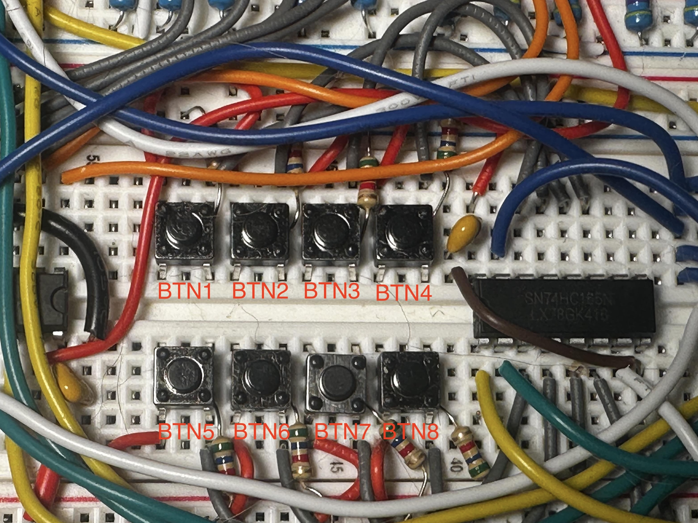
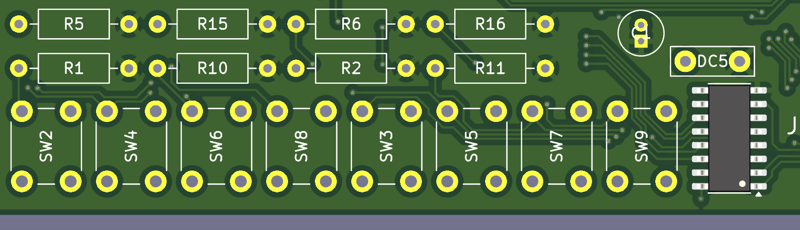
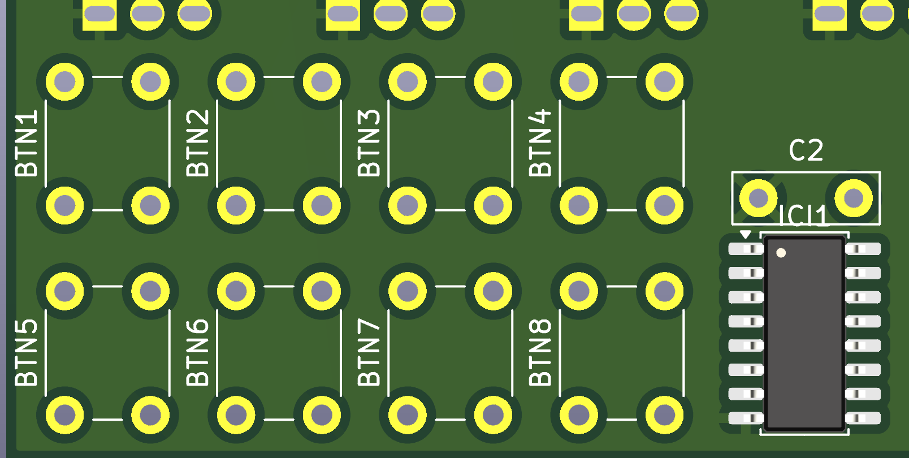

# shiftr_c buttons overview
This document details the functionality of the 8 buttons in the shiftr circuit
- each button is connected to the 74HC165 parallel-in-serial-out (PISO) shift register

# BUTTONS FUNCTIONALITY
### BTN1
- main mode switch
    - when state is 0, all LEDs should be on
        - no other buttons will do anything when state is 0
    - state = 1 enables LED sequencing, pulsing, or whatever effect
### BTN2
- switch between LED sequence & pulse
    - 0 = sequence, 1 = pulse
### BTN3
- first effect mode button
    - for sequence, switch between normal bit chaser & normal byte chaser
    - 0 = bit, 1 = byte
### BTN4
- second effect mode button
    - for bit chaser, modify the num_sr arg to make a second bit light up
### BTN5
- not yet defined
### BTN6
- not yet defined
### BTN7
- not yet defined
### BTN8
- reverse button
    - reverses LED effect

# BUTTON LAYOUT

** SW2-9 is equivalent to BTN1-8

